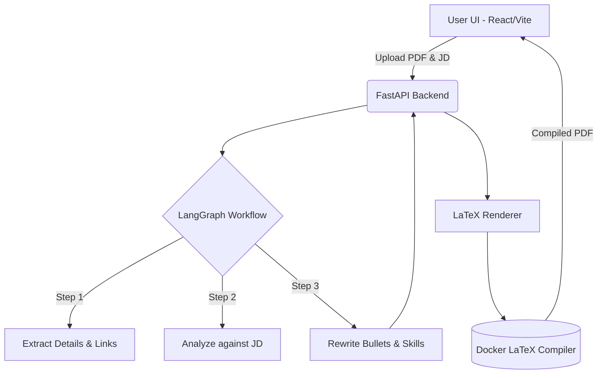

<div align="center">
  <h1>Resume Reworker 📄✨</h1>
  <p><strong>An AI-powered application to analyze, rewrite, and instantly generate ATS-friendly LaTeX resumes tailored to any job description.</strong></p>
</div>

<br />

## 🎯 The Idea

The days of manually tweaking your resume for every job application are over. Resume Reworker is an intelligent agent that takes your base resume and a target job description, and handles the rest:

1. **Analyzes** your resume against the job description to find missing keywords and weak points.
2. **Rewrites** your bullet points to naturally incorporate keywords and highlight the most relevant skills—without hallucinating or fabricating experience.
3. **Generates** a beautifully typeset, ATS-compliant PDF on the fly using a dedicated LaTeX compilation engine.

## ✨ Features

- **Smart ATS Analysis:** Get immediate feedback on what keywords you missed and how to improve.
- **Agentic Rewriting:** Powered by **LangGraph**, the AI pipeline breaks down rewriting into robust, reliable steps that avoid data corruption (e.g., losing hyperlinks or contact info).
- **Multi-Model Support:** Plug in your API keys for **Google Gemini, Mistral, Groq,** or **HuggingFace** models.
- **Live PDF Preview:** See your LaTeX resume compile instantly as you tweak the results.
- **Built-in Templates:** Choose from industry-standard LaTeX templates (like Jake's Resume Template).
- **Interactive UI:** Built for speed with a modern React + Vite + Tailwind interface.

---

## 🏗️ Architecture



## 🛠️ Tech Stack

### Frontend
- **Framework:** React 19 + Vite
- **Styling:** Tailwind CSS v4 + Framer Motion
- **State Management:** Zustand + SWR
- **Components:** Shadcn UI & Radix Primitives

### Backend
- **API:** FastAPI (Python 3.14)
- **Database:** PostgreSQL (SQLAlchemy + asyncpg)
- **Caching & Rate Limiting:** Redis
- **AI Orchestration:** LangGraph + LangChain

### Infrastructure
- **PDF Generation:** Custom isolated Docker container (`latex-compiler`)
- **Containerization:** Docker Compose

---

## 🚀 Setup & Installation

### Prerequisites
1. **Docker & Docker Compose** (required for the database, Redis, and LaTeX compilation engine).
2. **Node.js** (v20+ recommended) for the frontend.
3. **Python 3.14+** for the backend.

### 1. Backend Setup

```bash
cd backend
# Create a virtual environment
python -m venv .venv
source .venv/bin/activate

# Install dependencies
pip install -r requirements.txt

# Start the infrastructure (PostgreSQL, Redis, LaTeX compiler)
docker-compose up -d

# Set up environment variables
cp .env.example .env
# Edit .env with your DB credentials and JWT secrets

# Run the backend
./backend.sh
```

### 2. Frontend Setup

```bash
cd frontend
# Install dependencies
npm install

# Run the development server
npm run dev
# OR use the provided script
./frontend.sh
```

### 3. Usage
- Navigate to `http://localhost:5173`
- Create an account or sign in with Google OAuth.
- Navigate to the **Profile** section to input your API keys (e.g., Gemini, Groq).
- Upload your current resume PDF and paste a Job Description to begin the AI workflow!

---

## 📝 Configuration

- **Prompt Engineering:** You can adjust the system prompts and strict extraction rules in `backend/utils/prompts.py`.
- **LaTeX Templates:** The base LaTeX templates are stored as Jinja2 templates in `backend/templates/`. You can customize spacing, fonts, or colors here.

## 🤝 Contributing

Contributions are welcome! Please open an issue or submit a pull request if you want to add new LaTeX templates or support for new LLM providers.
